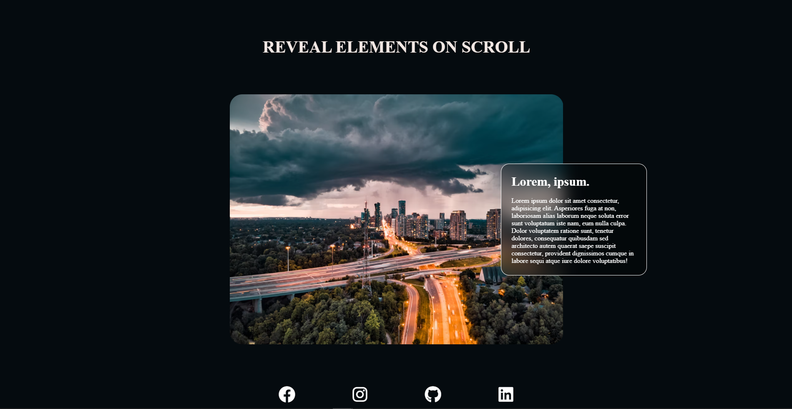

# Scroll Reveal

# 

Shows the page content based on scroll position.

> Check it out: [https://flashcodx.github.io/scroll-reveal/](https://flashcodx.github.io/scroll-reveal/)

## Tech:

- [React] - HTML enhanced for web apps!
- [Vs Code] - A multi language code editor.
- CSS Grid
- CSS Flex
- Scroll Reveal React Lib

## License

MIT

**Free Software, Hell Yeah!**

[react]: https://reactjs.org/
[font awesome]: https://fontawesome.com/
[vs code]: https://code.visualstudio.com/
